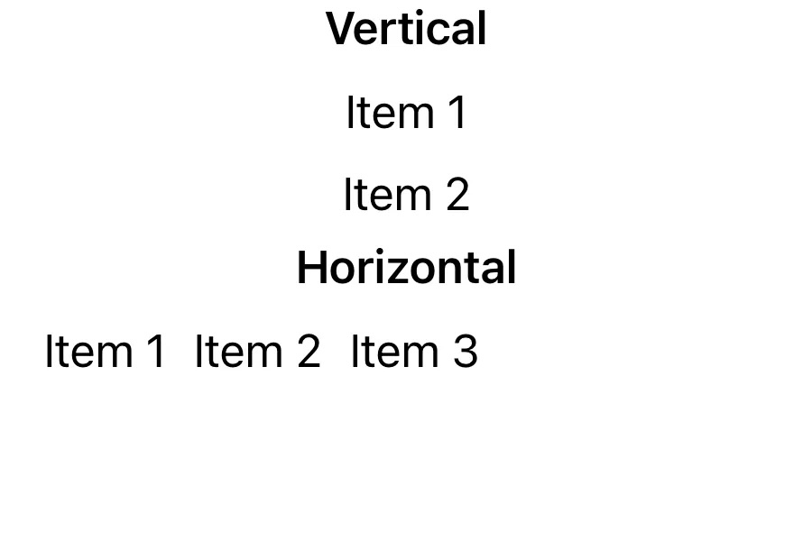

# Deep Dive into SwiftUI Containers

@Metadata {
    @TitleHeading("Key Takeaways from WWDC24")
    @Available("", introduced: "2024.08.12")
    @PageImage(purpose: icon, source: "WWDC24-Icon")
    @PageImage(purpose: card, source: "WWDC24")
}

This article delves into the new SwiftUI container APIs from WWDC24, showcasing how to build custom, flexible, and performant Layouts using advanced `ForEach`/`Group` initializers and `ContainerValues`. It covers practical implementations for section support, item limits, and expandable sections in iOS 18+ applications.

## Introduction

SwiftUI has always offered a comprehensive range of container views designed to structure content and apply common visual appearances and behaviors. From the familiar `HStack`, `VStack`, and `ZStack` for arranging elements to the more specialized `List` for displaying collections of data, these containers have been instrumental in making UI development efficient and intuitive.

At WWDC24, Apple introduced exciting new features and capabilities for container views in SwiftUI, expanding the toolkit available to developers. These advancements promise to provide even greater flexibility and control in layout design.
In this post, we’ll explore these new features, with a particular focus on how to write custom containers. We’ll see how these additions can enhance your app’s user interface and allow for more sophisticated layout structures that were previously challenging to implement.
Whether you’re a seasoned SwiftUI developer or just starting out, understanding these new container view features will be crucial for creating modern and visually appealing iOS apps. Let’s dive in and discover how WWDC24 has expanded the possibilities of SwiftUI containers.

## Background

Before diving into the new features from WWDC24, let’s quickly review what container views are in SwiftUI and why they’re important.

Container views are specialized components that organize and manage other views, playing a key role in building complex layouts. They handle the positioning and sizing of child views, allowing developers to create responsive and structured interfaces. By combining simpler views, containers enable the composition of more complex UIs. Additionally, certain containers, like `List`, provide shared behaviors such as scrolling and selection.

Common built-in containers include:
- `HStack` and `VStack` for horizontal and vertical layouts
- `ZStack` for overlaying views
- `List` and `ForEach` for data collections
- `ScrollView` for scrollable content

While these containers cover many needs, custom containers offer more specialized layouts. The new features introduced at WWDC24 enhance these capabilities, giving developers even more tools to create and customize container views. In the following sections, we’ll explore these advancements and their impact on SwiftUI development.

The new features introduced at WWDC24 build upon this foundation, providing more powerful tools for creating and customizing container views. In the following sections, we’ll explore these new capabilities and how they can enhance your SwiftUI development.

## New Features for Container Views

In iOS 18.0, Apple introduced several new features in SwiftUI that add more flexibility for writing container views. These enhancements allow developers to create more versatile and customizable layouts. Let’s explore these new features in detail.

### New ForEach and Group Initializers

Previously, creating custom container views with dynamic content was limited to using collections of a specific data type and a `@ViewBuilder` closure. Now, SwiftUI offers new initializers for `ForEach` and `Group` that provide greater flexibility:

```swift
extension ForEach {
    public init<V>(subviews view: V, @ViewBuilder content: @escaping (Subview) -> Content) where Data == ForEachSubviewCollection<Content>, ID == Subview.ID, Content : View, V : View
}

extension Group {
    public init<V>(subviews view: V, @ViewBuilder transform: @escaping (SubviewsCollection) -> Result) where Content == GroupElementsOfContent<Base, Result>, Base : View, Result : View
}
```

These new initializers allow you to create container views that are more flexible and generic, without relying on data-driven properties.

### Flexible Custom Containers

Let’s compare the old approach with the new one:

**Old Approach:**

```swift
struct CustomList<Item: Identifiable, Content: View>: View {
    let data: [Item]
    @ViewBuilder var content: (Item) -> Content
    var body: some View {
        ScrollView {
            ForEach(data) { item in
                CustomView(content: content(item))
            }
        }
    }
}
```

**New Approach:**

```swift
struct CustomList<Content: View>: View {
    @ViewBuilder var content: Content
    var body: some View {
        ScrollView {
            ForEach(subviews: content) { subview in
                CustomView(content: subview)
            }
        }
    }
}
```

The new approach allows for more flexibility, enabling you to combine static items, multiple `ForEach` statements, and different view types within the same container, without the need to rely on a data type.

### Section Support in Custom Containers

SwiftUI now provides support for sections in custom container views through new initializers for `Group` and `ForEach`:

```swift
extension Group {
    public init<Base, Result>(sections view: Base, @ViewBuilder transform: @escaping (SectionCollection) -> Result) where Content == GroupSectionsOfContent<Base, Result>, Base : View, Result : View
}

extension ForEach {
    public init<V>(sections view: V, @ViewBuilder content: @escaping (SectionConfiguration) -> Content) where Data == ForEachSectionCollection<Content>, ID == SectionConfiguration.ID, Content : View, V : View
}
```

These initializers allow you to extract and manage subviews grouped by sections, including their headers and footers.

### ContainerValues for Customization

SwiftUI introduces `ContainerValues`, a powerful tool for creating container-specific modifiers. Unlike `EnvironmentValues` or `Preferences`, `ContainerValues` are accessible only by the direct container, making them ideal for container-specific customizations.

Here’s how to define and use a container value:

```swift
extension ContainerValues {
    var isItemHighlighted: Bool = false
}

extension View {
    func itemHighlighted(_ isHighlighted: Bool) -> some View {
        containerValue(\.isItemHighlighted, isHighlighted)
    }
}
```

You can then apply and access these values in your custom container:

```swift
struct CustomList<Content: View>: View {
    @ViewBuilder var content: Content
    var body: some View {
        ScrollView {
            Group(sections: content) { sections in
                ForEach(sections) { section in
                    ForEach(subviews: section.content) { subview in
                        let contentValues = subview.containerValues
                        CustomView(content: subview)
                            .bold(contentValues.isItemHighlighted)
                    }
                }
            }
        }
    }
}
```

### Key Takeaways

These new features in SwiftUI for iOS 18.0 significantly enhance the flexibility and power of custom container views:
- New initializers for `ForEach` and `Group` allow for more versatile content composition.
- Improved support for sections in custom containers enables better content organization.
- `ContainerValues` provide a targeted way to customize individual items within a container.
These additions open up new possibilities for creating sophisticated, customizable layouts in SwiftUI.

## Writing a Custom Container

Let’s move from theory to practice by creating a custom container for an app’s home feed. In this section, we’ll implement a flexible and feature-rich container view using the new SwiftUI APIs introduced in iOS 18.0.

Throughout this tutorial, we’ll cover:
- Setting up the basic structure of a custom container
- Implementing support for both static and dynamic content
- Adding section support with headers and footers
- Customizing section layouts with horizontal and vertical orientations
- Limiting the number of items displayed in a section
- Creating an expandable/collapsible mechanism for sections with hidden items

By the end of this section, you’ll have a practical understanding of how to leverage the new container APIs to create a versatile and customizable layout for your app’s home screen. This example will demonstrate how to aggregate content from various app features, making it an ideal solution for complex, content-rich interfaces.

Let’s dive in and start building our custom `FeedContainer`!

We will start by declaring a new view called `FeedContainer`, which will accept content view builder to resolve its sections and items.

```swift
struct FeedContainer<Content: View>: View {
    @ViewBuilder var content: Content

    var body: some View {
        content
    }
}
```

The next step will be to use new initializer for Group that resolves all the sections from the content view builder. So now it is possible to iterate over each section using `ForEach` and just draw the content of the section (its items, header and footer if present).

```swift
struct FeedContainer<Content: View>: View {
    @ViewBuilder var content: Content

    var body: some View {
        ScrollView {
            LazyVStack {
                Group(sections: content) { sections in
                    ForEach(sections) { section in
                        if !section.header.isEmpty {
                            section.header
                        }
                        section.content
                        if !section.footer.isEmpty {
                            section.footer
                        }
                    }
                }
            }
        }
    }
}

#Preview {
    FeedContainer {
        Section {
            Text("Item 1")
            Text("Item 2")
            Text("Item 3")
        } header: {
            Text("Header").bold()
        }
    }
}
```

It will look like this:


We added support for both static and dynamic items (resolved by the content-view builder), as well as support for sections, including headers and footers.

The next step will be to add some custom behavior to the home feed. We want to add support for section Axis customization. The main idea is to provide a way for the container to determine how to present items within a section. To achieve this, the new `ContainerValues` API comes into play.

Let’s define a property in `ContainerValues` that will store the section Axis, along with a corresponding view modifier.

```swift
extension ContainerValues {
    var sectionAxis: Axis = .vertical
}

extension View {
    func sectionAxis(_ axis: Axis) -> some View {
        containerValue(\.sectionAxis, axis)
    }
}
```

This allows us to specify which layout to choose for the section. Now we need to update our implementation to support two different options for displaying section content. We will add two separate functions for both axes.

For the vertical case, we will wrap the section’s subview in a `LazyVStack`. For the horizontal case, we will use the horizontal alternative, `LazyHStack`, but we will also wrap it in a `ScrollView` to enable scrolling through the section items.

Now we need to modify the body to use the appropriate builder function based on the axis. To do this, we should resolve the section content values and check the `sectionAxis` property.

```swift
struct FeedContainer<Content: View>: View {
    // ...
    var body: some View {
        ScrollView {
            LazyVStack {
                Group(sections: content) { sections in
                    ForEach(sections) { section in
                        // ...
                        switch section.containerValues.sectionAxis {
                        case .vertical:
                            buildVerticalSection(section.content)
                        case .horizontal:
                            buildHorizontalSection(section.content)
                        }
                        // ...
                    }
                }
            }
        }
    }
    
    private func buildVerticalSection(_ subviews: SubviewsCollectionSlice) -> some View {
        LazyVStack(spacing: 10) {
            subviews
        }
        .padding(.horizontal)
    }
    
    private func buildHorizontalSection(_ subviews: SubviewsCollectionSlice) -> some View {
        ScrollView(.horizontal) {
            LazyHStack(spacing: 10) {
                subviews
            }
            .padding(.horizontal)
        }
    }
}

#Preview {
    FeedContainer {
        Section {
            Text("Item 1")
            Text("Item 2")
            Text("Item 3")
        } header: {
            Text("Vertical").bold()
        }
        
        Section {
            Text("Item 1")
            Text("Item 2")
            Text("Item 3")
        } header: {
            Text("Horizontal").bold()
        }
        .sectionAxis(.horizontal)
    }
}
```

Now we can specify the axis for each section and display its items differently.


Next, we need to add support for limiting the number of items displayed in each section. The implementation algorithm is similar: declare a container values property to store the section limit, then obtain this value and filter the section subviews before displaying them.

Since we want to use the `prefix` function, which returns a `SubviewsCollectionSlice` instead of a `SubviewsCollection`, we need to adjust our approach. Let's make the necessary changes to support this limitation as well.

Here, you can see the updated version of `FeedContainer` with the changes mentioned above.

```swift
extension ContainerValues {
    var sectionItemsLimit: Int = 0
}

extension View {
    func sectionItemsLimit(_ limit: Int) -> some View {
        containerValue(\.sectionItemsLimit, limit)
    }
}

struct FeedContainerV4<Content: View>: View {
    // ...
    var body: some View {
        ScrollView {
            LazyVStack {
                Group(sections: content) { sections in
                    ForEach(sections) { section in
                        // ...
                        let itemsLimit = section.containerValues.sectionItemsLimit
                        let subviews = section.content.prefix(itemsLimit > 0 ? itemsLimit : section.content.count)
                        switch section.containerValues.sectionAxis {
                        case .vertical:
                            buildVerticalSection(subviews)
                        case .horizontal:
                            buildHorizontalSection(subviews)
                        }
                        // ...
                    }
                }
            }
        }
    }
//...
}

#Preview {
    FeedContainer {
        Section {
            Text("Item 1")
            Text("Item 2")
            Text("Item 3")
        } header: {
            Text("Vertical").bold()
        }
        .sectionItemsLimit(2)
        
        Section {
            Text("Item 1")
            Text("Item 2")
            Text("Item 3")
        } header: {
            Text("Horizontal").bold()
        }
        .sectionAxis(.horizontal)
    }
}
```

Let’s take a look at what is now displayed in the preview.



The first vertical section no longer shows the third item. This is because we limited the section to two items using our new `sectionItemsLimit` modifier. This feature can be quite useful for home pages, where you typically don’t want to display all content but rather limit it to recent or most popular items.

We are nearly finished with our feature list for this sample app. However, one thing is still missing: the ability to display hidden items when the section item count is limited. Therefore, we need to add functionality for expanding and collapsing the section.

But before we dive into that, let’s enhance our list’s appearance, which is easy and quick to do in SwiftUI. We’ll create two different views for displaying text and color items and add some styling for the headers.

```swift
struct TextItem: View {
    let title: String

    var body: some View {
        Text(title)
            .font(.body)
            .padding(10)
            .frame(maxWidth: .infinity, alignment: .leading)
            .background(Color.black.opacity(0.1).clipShape(RoundedRectangle(cornerRadius: 5)))
    }
}

struct ColorItem: View {
    let color: Color

    var body: some View {
        color
            .frame(width: 50, height: 50)
            .clipShape(RoundedRectangle(cornerRadius: 5, style: .circular))
    }
}
```

Now we need to update our preview to showcase all the functionality we’ve added so far. We’ll create:
- A section with dynamic text items (data-driven): We’ll apply an item limit to this section, and it will be displayed as a vertical list by default because we won’t specify its axis.
- A section with static items and a horizontal axis: This will demonstrate how a horizontal list appears.
- A section with color items: This will make our sample app more realistic. We’ll provide a number of items that won’t fit on the screen to test scrolling in sections with a horizontal axis.

By setting up these sections, we’ll be able to fully demonstrate the features and functionality of our custom container.

```swift
#Preview {
    FeedContainer {
        Section {
            ForEach(1 ... 10, id: \.self) { index in
                TextItem(title: "Item \(index)")
            }
        } header: {
            Text("Dynamic Vertical section")
        }
        .sectionItemsLimit(3)
        .id(AnyHashable("123"))

        Section {
            TextItem(title: "Item 1")
            TextItem(title: "Item 2")
            Text("Item 3")
            TextItem(title: "Item 4")
        } header: {
            Text("Static Horizontal section")
        }.sectionAxis(.horizontal)

        Section {
            ColorItem(color: .red)
            ColorItem(color: .green)
            ColorItem(color: .blue)
            ColorItem(color: .brown)
            ColorItem(color: .pink)
            ColorItem(color: .purple)
            ColorItem(color: .cyan)
        } header: {
            Text("Static Horizontal section")
        }.sectionAxis(.horizontal)
    }
}
```

This is how our preview looks now.


We have a fairly good UI, but we’re still missing some functionality. Specifically, we need to add support for expanding sections that have item limits. To address this, we’ll introduce an optional toggle button in the section header. This button will only appear if a limit is specified and if the number of items exceeds this limit. The following code snippet demonstrates how we can implement this feature.

```swift
struct FeedContainer<Content: View>: View {
    // ...
    @State private var expandedSections = Set<SectionConfiguration.ID>()

    var body: some View {
        ScrollView(.vertical) {
            LazyVStack(spacing: 0) {
                Group(sections: content) { sections in
                    ForEach(sections) { section in
                        let itemsLimit = section.containerValues.sectionItemsLimit
                        let isExpanded = expandedSections.contains(section.id)
                        if !section.header.isEmpty {
                            HStack(alignment: .center) {
                                section.header
                                    .font(.title)
                                    .frame(maxWidth: .infinity, alignment: .leading)
                                if itemsLimit > 0, section.content.count > itemsLimit {
                                    Button(action: {
                                        withAnimation {
                                            if isExpanded {
                                                expandedSections.remove(section.id)
                                            } else {
                                                expandedSections.insert(section.id)
                                            }
                                        }
                                    }) {
                                        Image(systemName: isExpanded ? "rectangle.compress.vertical" : "rectangle.expand.vertical")
                                    }
                                }
                            }
                            .padding()
                        }

                        
                        let subviews = section.content.prefix(!isExpanded && itemsLimit > 0 ? itemsLimit : section.content.count)
                        // ...
                    }
                }
            }
        }
    }
}
```

We declared an `expandedSections` state property to hold a set of IDs for expanded sections. Since `SectionConfiguration` conforms to `Identifiable`, we can use the `id` to store it for sections that need to be expanded.

The next step is to get the item limit for the section. We do this with `let itemsLimit = section.containerValues.sectionItemsLimit`. Then, we check if the section is expanded or not with `let isExpanded = expandedSections.contains(section.id)`.

Finally, for sections that exceed the item limit, we will show a button to expand or collapse them. We will use two icons from SF Symbols to represent the current action of the button when the user taps it. If the collection is not expanded, we will insert the section ID into `expandedSections`. Otherwise, we will remove it from the set. To enhance the visual experience, we will wrap this action in a `withAnimation` block, which will add standard animation to the collection changes.

We have accomplished everything we planned. Let’s look at what we have now and how it works!


Looks great! Of course, this is not a production UI, but it demonstrates an example of how we can create custom containers to meet our needs using the new container APIs.

## Challenges and Solutions

While implementing our custom `FeedContainer`, we encountered several challenges. Here's how we addressed them:

### Mixing Static and Dynamic Content

**Challenge:** SwiftUI’s previous container views often required choosing between static or data-driven content.

**Solution:** The new `ForEach` initializer allowed us to seamlessly combine both types of content within our custom container.

### Section-Specific Layouts

**Challenge:** We needed different layouts (horizontal and vertical) for different sections.

**Solution:** We used `ContainerValues` to store section-specific layout information, allowing each section to define its own axis.

### Limited Item Display with Expansion Option

**Challenge:** Implementing a way to limit displayed items while providing an expansion mechanism was complex.

**Solution:** We used a combination of `ContainerValues` for storing item limits and state management for tracking expanded sections. This approach enabled us to create a flexible system for showing and hiding content.

### Performance Considerations

**Challenge:** With potentially large amounts of content, performance could become an issue.

**Solution:** We utilized `LazyVStack` and `LazyHStack` to ensure that only visible content is rendered. For horizontal scrolling sections, we nested `ScrollView` inside `LazyVStack` to maintain efficiency.

### Consistent Styling Across Different Content Types

**Challenge:** Maintaining a consistent look while accommodating various content types (text, colors, etc.) was difficult.

**Solution:** We created reusable view components (`TextItem`, `ColorItem`) that encapsulate styling, ensuring consistency across different content types.

### Animation Smoothness

**Challenge:** Expanding and collapsing sections could lead to jerky transitions.

**Solution:** We wrapped our expand/collapse logic in `withAnimation` blocks to ensure smooth, native-feeling animations when revealing or hiding content.

By addressing these challenges, we created a flexible, performant, and visually appealing custom container capable of handling a wide variety of content types and layouts. This approach highlights the power and flexibility of the new SwiftUI container APIs.

## Summary

In this article, we explored a new API in SwiftUI for creating custom containers. We examined the added functionality and how it can be utilized. Additionally, we built a sample app using these new APIs, addressing the challenges we encountered and how we resolved them. This article serves as a starting point for those looking to create custom containers in SwiftUI with specific behavior.

It’s important to note that these new APIs will only be available in iOS 18.0 and Xcode 16. As both iOS and Xcode are currently unreleased, the APIs are still in beta, and changes might occur (for example, the naming currently differs slightly from what was shown in the WWDC session). You’ll need to wait for the next public release to use these APIs, and your app’s deployment target must be iOS 18.

As SwiftUI continues to evolve, staying updated on these developments will be crucial for developers looking to leverage the full potential of custom containers in their apps. Keep experimenting, and don’t hesitate to share your experiences with the community!

For more detailed information about these changes, please refer to the Demystify SwiftUI containers WWDC24 session.
