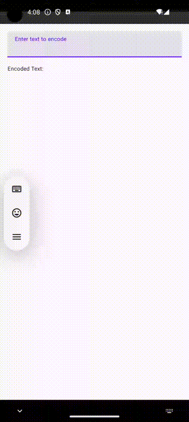

# I. Kotlin Flow to Swift Combine: A KMP Bridge.

@Metadata {
    @TitleHeading("Part I")
    @Available("", introduced: "2024.08.26")
    @PageImage(purpose: icon, source:"kotlin_swift_bridge_logo.png")
    @PageImage(purpose: card, source:"kotlin_swift_bridge_logo.png")
}

This article explores Kotlin Flow with Swift Combine in Kotlin Multiplatform projects. It details converting between `Flow` and `Publisher`, highlighting the challenges of type erasure and generics in Swift/Objective-C interoperability, and demonstrates potential runtime issues.

## Introduction

Cross-platform development offers numerous opportunities to build a shared codebase, but it also introduces several limitations. If you’re working on a Kotlin Multiplatform project that handles data flows, you might have encountered challenges in bridging Kotlin’s `Flow` with Swift's `Combine`.
In this series of articles, we will explore how to convert a KotlinFlow into a Swift Combine Publisher and vice versa. We will also examine the limitations of Kotlin to Objective-C/Swift interoperability and discuss the issues that may arise.

## Background

Kotlin Multiplatform enables us to share business logic across different platforms, making it easier to maintain consistent behavior in both iOS and Android applications. This shared code is particularly useful when identical functionality is required on both platforms. While implementing simple features is relatively straightforward, handling more complex tasks — such as managing data streams — can be quite challenging.

One of the difficulties arises from the fact that there is no built-in way to convert Kotlin’s Flow into Swift’s Publisher. Developers must handle this conversion manually, which is further complicated by the different concurrency models and limitations in interoperability between Swift/Objective-C and Kotlin. A significant challenge in this context is the restricted support for generics.

> Note: Objective-C generics do not support all features of either Kotlin or Swift, so there will be some information lost in the translation. 
> 
> Generics can only be defined on classes, not on interfaces (protocols in Objective-C and Swift) or functions.

For more information on translating Kotlin code to Swift, refer to the official documentation on [Interoperability with Swift/Objective-C](https://kotlinlang.org/docs/native-objc-interop.html).

## Using Kotlin Flows in iOS

Let's explore how to define some shared sample code in Kotlin that uses `Flow` for both input and output. In our example, we've defined a `TextEncoder` class that takes a `Flow` of `String`s as input and provides another `Flow` of `String`s that are Base64 encoded. This allows us to display encoded text on the fly whenever the original text changes.

```java
class TextEncoder(rawText: Flow<String>) {
    @OptIn(ExperimentalEncodingApi::class)
    val encodedText: Flow<String> = rawText.map { text ->
        Base64.encode(text.encodeToByteArray())
    }
}
```

When this Kotlin code is translated into Objective-C, it will look something like this:

```objc
__attribute__((objc_subclassing_restricted)) __attribute__((swift_name("TextEncoder")))
@interface CommonTextEncoder : CommonBase
- (instancetype)initWithRawText:(id<CommonKotlinx_coroutines_coreFlow>)rawText __attribute__((swift_name("init(rawText:)"))) __attribute__((objc_designated_initializer));
@property (readonly) id<CommonKotlinx_coroutines_coreFlow> encodedText __attribute__((swift_name("encodedText")));
@end

__attribute__((swift_name("Kotlinx_coroutines_coreFlow")))
@protocol CommonKotlinx_coroutines_coreFlow
@required
```

Here, `Flow<String>` is translated into `Kotlinx_coroutines_coreFlow`. This results in a completely type-erased protocol, which loses critical information about the type we're working with. While this issue is significant, let's set it aside for now and focus on the core problem: mapping Combine's `Publisher` to Kotlin's `Flow`.

## Map Publisher to Flow

To provide text input for `TextEncoder`, we need to implement `Kotlinx_coroutines_coreFlow` in Swift. First, let's examine the `Flow` declaration in Kotlin:

```java
public interface Flow<out T> {
    public suspend fun collect(collector: FlowCollector<T>)
}
```

`Flow` is an asynchronous data stream that sequentially emits values and completes either normally or with an exception. It has one asynchronous function, `collect`, which accepts a `FlowCollector`. The data can be collected with the provided collector until it either finishes or an exception is thrown.

With this in mind, we can implement this protocol in Swift:

```swift
final class Flow<P>: Kotlinx_coroutines_coreFlow where P: Publisher {
    private let values: AsyncThrowingPublisher<P>
    init(publisher: P) {
        values = publisher.values
    }

    @MainActor
    func collect(collector: any Kotlinx_coroutines_coreFlowCollector) async throws {
        for try await value in values {
            try await collector.emit(value: value)
        }
    }
}

extension Publisher {
    var flow: Flow<Self> {
        Flow(publisher: self)
    }
}
```

The implementation is fairly straightforward. Combine's `Publisher` has a property `values` of type `AsyncThrowingPublisher`, which is an `AsyncSequence`. This allows us to asynchronously iterate over its values and call the `emit` function on `Kotlinx_coroutines_coreFlowCollector` (known as `FlowCollector` in Kotlin) for each of them.

That's it. Since `collect` is an asynchronous throwing function, it will execute asynchronously while there are values to process or until an error is thrown. One important detail to note is that we are executing `collect` on the `MainActor`. This is necessary due to limitations in how Kotlin coroutines are used in Swift.


## Map Flow to Publisher

To get our app running, we need to convert `Kotlinx_coroutines_coreFlow` into a `Publisher` so that we can subscribe to it. Implementing a custom publisher requires defining the type of elements (called `Output`), the type of failure (which should conform to `Error`, or `Never` if it doesn't fail), and handling new subscribers. Handling new subscribers involves creating a custom `Subscription` and providing it to the subscriber via the `receive(subscription:)` function.

Let's take a look at the declarations of the `Publisher`, `Subscription`, and `Subscriber` protocols:

```swift
public protocol Publisher<Output, Failure> {
    associatedtype Output
    associatedtype Failure : Error
    func receive<S>(subscriber: S) where S : Subscriber, Self.Failure == S.Failure, Self.Output == S.Input
}

public protocol Subscription : Cancellable, CustomCombineIdentifierConvertible {
    func request(_ demand: Subscribers.Demand)
}

public protocol Subscriber<Input, Failure> : CustomCombineIdentifierConvertible {
    associatedtype Input
    associatedtype Failure : Error
    func receive(subscription: any Subscription)
    func receive(_ input: Self.Input) -> Subscribers.Demand
    func receive(completion: Subscribers.Completion<Self.Failure>)
}
```

Since we want to subscribe to the `Flow` data stream, we must provide a `FlowCollector` when collecting elements. We'll name the publisher class `FlowCollector` to keep the naming consistent. This class will store a `Flow` provided by the shared Kotlin library and create a `FlowCollectorSubscription` for each new subscriber. The `FlowCollectorSubscription` class will have a function called `collect`, which handles the actual data collection and its propagation to the subscriber.

Here's what the `FlowCollector` publisher looks like:

```swift
extension Publishers {
    final class FlowCollector<Output, Failure>: Publisher where Failure: Error {
        private let flow: Kotlinx_coroutines_coreFlow

        init(flow: Kotlinx_coroutines_coreFlow) {
            self.flow = flow
        }

        func receive<S>(subscriber: S) where S : Subscriber, Failure == S.Failure, Output == S.Input {
            let subscription = FlowCollectorSubscription(subscriber: subscriber, flow: flow)
            subscriber.receive(subscription: subscription)
            subscription.collect()
        }
    }
}
```

The `Subscription` implementation is a bit more complex, so let's break it down step by step. First, let's declare its type conformances:

```swift
fileprivate final class FlowCollectorSubscription<S>: Subscription, Kotlinx_coroutines_coreFlowCollector where S: Subscriber
```

`FlowCollectorSubscription` conforms to `Kotlinx_coroutines_coreFlowCollector` (`FlowCollector` in Kotlin). Here's its declaration:

```java
public fun interface FlowCollector<in T> {
    public suspend fun emit(value: T)
}
```

To start collecting data from the `Flow`, we need to call `collect` on it in an asynchronous context and provide a collector to accept elements. To do that, our `Subscription` should store both the `Flow` and the `Subscriber`:

```swift
fileprivate final class FlowCollectorSubscription<S>: Subscription, Kotlinx_coroutines_coreFlowCollector where S: Subscriber {
    var subscriber: S?
    let flow: Kotlinx_coroutines_coreFlow

    init(subscriber: S?, flow: Kotlinx_coroutines_coreFlow) {
        self.subscriber = subscriber
        self.flow = flow
    }

    func request(_ demand: Subscribers.Demand) {
        /* Ignore demand */
    }

    func collect() {
        // Handle collection
    }

    func cancel() {
        // Handle cancellation
    }

    func emit(value: Any?) async throws {
        // Handle new values
    }
}
```

Now, let's implement the `collect` function. Since Kotlin's `Flow.collect` function is asynchronous, we need to start a new unstructured task to collect data. Our `Subscription` conforms to the `Cancellable` protocol, so we need to be able to cancel our task if the subscription is canceled. We'll store a reference to our task for this purpose. In `collect`, we call `collect` on the `Flow`, providing `self` as the collector, and wrap it in a `try-catch` block so we can send completion to the subscriber when collection finishes either by error or successfully. Here's what we end up with:

```swift
fileprivate final class FlowCollectorSubscription<S>: Subscription, Kotlinx_coroutines_coreFlowCollector where S: Subscriber {
    // ...
    func collect() {
        collectionTask = .detached { @MainActor [weak self] in
            guard let self else { return }
            do {
                try await flow.collect(collector: self)
            } catch {
                if let error = error as? S.Failure {
                    subscriber?.receive(completion: .failure(error))
                } else {
                    subscriber?.receive(completion: .finished)
                }
            }
        }
    }

    func cancel() {
        collectionTask?.cancel()
        collectionTask = nil
        subscriber = nil
    }
    // ...
}
```

We're halfway done. We can now subscribe to the `Flow` and complete our publisher when it finishes. The only remaining task is to propagate the values emitted by the `Flow` to the subscriber. However, since `Kotlinx_coroutines_coreFlowCollector` is type-erased, we don't know the type of the values coming from the `Flow`. But we do have the type of the subscriber's `Input`. This is what subscribers expect to receive. We'll cast the value to this type and send it to the subscriber or throw an error if the types don't match:

```swift
fileprivate final class FlowCollectorSubscription<S>: Subscription, Kotlinx_coroutines_coreFlowCollector where S: Subscriber {
    struct TypeCastError: LocalizedError {
        let receivedType: Any.Type
        let expectedType: Any.Type
        var errorDescription: String? {
            "Failed to cast value of type \(receivedType) to expected type \(expectedType)."
        }
    }

    // ..
    func emit(value: Any?) async throws {
        guard let expectedValue = value as? S.Input else {
            throw TypeCastError(receivedType: type(of: value), expectedType: S.Input.self)
        }
        _ = subscriber?.receive(expectedValue)
    }
}
```

Now we're done. Let's connect everything and test it in a sample app.

## Bringing It All Together

To demonstrate how everything is connected and works together, we will create a simple demo app that features an input field. This input field generates elements with each text change, which are then passed to the shared `TextEncoder` from Kotlin. The `TextEncoder` produces Base64 encoded strings as a `Flow`, which we will display in a label.

I won't delve into setting up a Kotlin Multiplatform project; instead, we'll focus on how to connect the `TextEncoder` in both the Android and iOS apps. Since Kotlin is native to the Android platform, let's start there.

### Android implementation

```swift
class ContentViewModel : ViewModel() {
    private val _rawText = MutableStateFlow("")
    val rawText: StateFlow<String> = _rawText

    private val _encodedText = MutableStateFlow("")
    val encodedText: StateFlow<String> = _encodedText

    private val textEncoder = TextEncoder(_rawText)

    init {
        collectEncodedText()
    }

    private fun collectEncodedText() {
        viewModelScope.launch {
            textEncoder.encodedText.collect { encoded ->
                _encodedText.value = encoded
            }
        }
    }

    fun updateRawText(newText: String) {
        _rawText.value = newText
    }
}

@Composable
fun ContentView(viewModel: ContentViewModel = viewModel()) {
    val inputText by viewModel.rawText.collectAsState()
    val encodedText by viewModel.encodedText.collectAsState()

    Column(
        modifier = Modifier
            .padding(16.dp)
            .fillMaxSize()
    ) {
        TextField(
            value = inputText,
            onValueChange = { viewModel.updateRawText(it) },
            label = { Text("Enter text to encode") },
            modifier = Modifier.fillMaxWidth()
        )
        Spacer(modifier = Modifier.height(16.dp))
        Text(
            text = "Encoded Text: $encodedText",
            style = MaterialTheme.typography.bodySmall
        )
    }
}
```

### iOS Implementation

Now, let's implement a similar setup for iOS.

```swift
final class ContentViewModel: ObservableObject {
    @Published var rawText: String = ""
    @Published var encodedText: String = ""

    private var encodedTextSubscription: AnyCancellable?

    init() {
        let textEncoder = TextEncoder(rawText: $rawText.flow)
        encodedTextSubscription = Publishers.FlowCollector(flow: textEncoder.encodedText)
            .receive(on: DispatchQueue.main)
            .assign(to: \.encodedText, on: self)
    }
}

struct ContentView: View {
    @StateObject private var viewModel = ContentViewModel()

    var body: some View {
        VStack {
            TextField("Enter text to encode", text: $viewModel.rawText)
                .textFieldStyle(RoundedBorderTextFieldStyle())
                .padding()

            Text("Encoded Text: \(viewModel.encodedText)")
                .padding()
        }
        .padding()
    }
}
```

With these implementations, both platforms will exhibit identical behavior.

Let’s see it in action:

@Row {
    @Column {
        
    }
    @Column {
        
    }
}


## The Pitfalls of Kotlin Generics in Swift Interoperability

Using the abstract `Flow` interface in shared KMP code can lead to type loss when translated into Swift. This results in type-unsafe code that might not be caught at compile-time but can cause runtime crashes if there are changes in the shared Kotlin library.

### Demonstrating API Vulnerabilities

Let's modify our `TextEncoder` to use a custom type for text instead of the standard `String`:

```java
data class TextString(val body: String)

class TextEncoder(rawText: Flow<TextString>) {
    @OptIn(ExperimentalEncodingApi::class)
    val encodedText: Flow<TextString> = rawText.map { text ->
        TextString(Base64.encode(text.body.encodeToByteArray()))
    }
}
```

After this change, the Android project will no longer compile. This is because we've made a breaking change in our API that requires adjustments in the codebase.


On iOS, however, no compilation errors will be reported. Since Kotlin's `Flow` is type-erased when translated to Swift, the compiler is unaware of the type changes. This will result in a runtime error.


What's more concerning is that the stack trace might not clearly indicate the root cause of the issue, making it difficult to diagnose the problem.

### Fixing the Type Mismatch

To resolve the type mismatch issue and ensure both the Android project compiles and the iOS project runs smoothly, we need to update the types used with `TextEncoder`. On Android, this involves simply adjusting the code to match the new API. While this is a standard practice when dealing with API changes, the situation on iOS is more challenging due to the type erasure and the lack of compile-time safety. This highlights the need for careful management of shared code across platforms.

## Wrapping Up

In this article, we explored the challenges of using Kotlin Flows in shared code for iOS and Android, focusing on the limitations and risks associated with Kotlin's type erasure when interoperating with Swift. The type mismatch issue serves as a key example of why it's essential to be cautious when sharing business logic across platforms.

In the next article, I'll demonstrate strategies to eliminate these issues and build a more stable and type-safe Kotlin Multiplatform (KMP) codebase.
