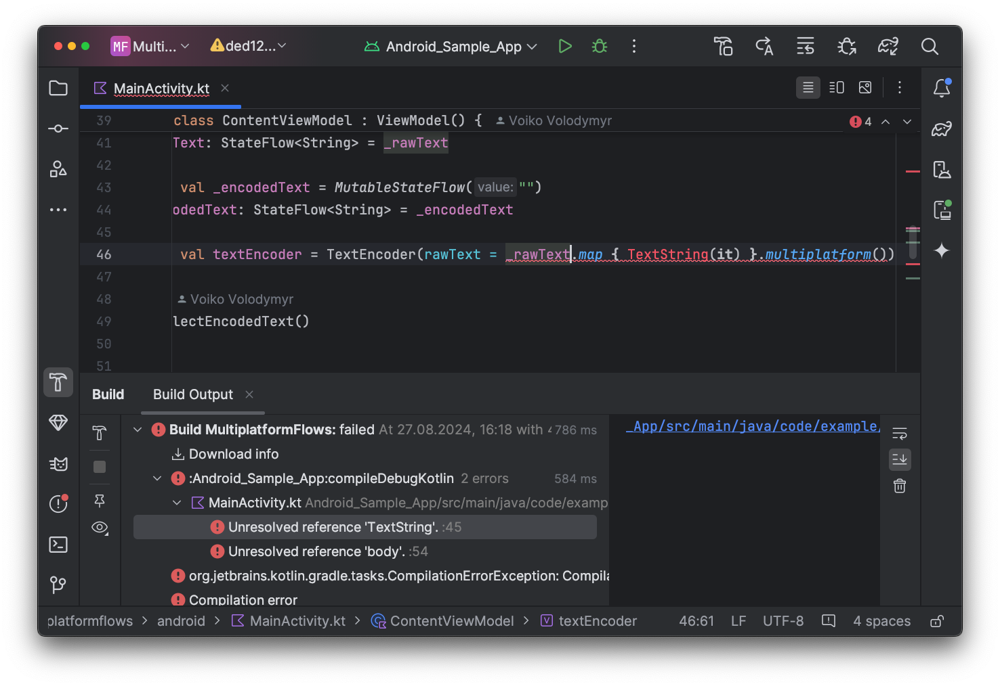

# II. Kotlin Flow to Swift Combine: A KMP Bridge.

@Metadata {
    @TitleHeading("Part II")
    @Available("", introduced: "2024.08.28")
    @PageImage(purpose: icon, source:"kotlin_swift_bridge_logo.png")
    @PageImage(purpose: card, source:"kotlin_swift_bridge_logo.png")
}

This article resolves KMP type-safety issues when bridging Kotlin Flows to Swift Combine. It uses `MultiplatformFlow`, a generic wrapper, to ensure type safety in both directions, enabling consistent compile-time error detection across Android and iOS.

## Introduction

In the [previous part](002_kotlin-flow-to-swift-combine-a-kmp-bridge-part-i) of this article, we explored how to connect Kotlin’s Flows with Swift’s Combine Publishers. We also examined the limitations of Kotlin’s interoperability with Swift/Objective-C and the pitfalls these limitations can create. In this part, we will explore a potential solution to this problem.

## Bringing Type Safety for KMP APIs in iOS

As you may remember, Kotlin's generic interfaces lose type information during translation to Swift/Objective-C. As a result, the API becomes type-unsafe and complex to integrate. Therefore, we need to find a way to preserve the type information.

The Kotlin documentation on generics interoperability states that generics are only supported when defined on classes. It seems like this is the only viable approach.

### Building a Generic-Preserving Flow

Let's create a wrapper class that has a generic parameter and implements the Flow interface. Since we are working on a multiplatform project, we'll name it `MultiplatformFlow`. As a wrapper, we'll add a constructor parameter to accept the wrapped Flow and use it as a delegate for the Flow interface implementation. For convenience, we'll also add an extension function on the Flow interface to facilitate wrapping.

```java
open class MultiplatformFlow<T : Any>(delegate: Flow<T>) : Flow<T> by delegate

fun <T : Any> Flow<T>.multiplatform(): MultiplatformFlow<T> = MultiplatformFlow(this)
```

Now, let's try to apply it to the input of our `TextEncoder`:

```java
class TextEncoder(rawText: MultiplatformFlow<TextString>) {
    @OptIn(ExperimentalEncodingApi::class)
    val encodedText: Flow<TextString> // ...
}
```

### Providing Type-Safe Flow from Swift

When we try to build our project, it fails. For Android, all we need to do is call the `multiplatform()` function on the text input flow, which will wrap it and fix the type mismatch:

```java
class ContentViewModel : ViewModel() {
    private val _rawText = MutableStateFlow("")
    // ...
    private val textEncoder = TextEncoder(
        rawText = _rawText.map { TextString(it) }.multiplatform()
    )
    // ...
}
```

However, on iOS, we now need to wrap the `Publisher` into `MultiplatformFlow` to prevent us from using a type-unsafe implementation. Let me remind you how the basic implementation looks:

```swift
extension Publishers {
    final class FlowCollector<Output, Failure>: Publisher where Failure: Error {
        private let flow: Kotlinx_coroutines_coreFlow
        init(flow: Kotlinx_coroutines_coreFlow) {
            self.flow = flow
        }
        func receive<S>(subscriber: S) where S : Subscriber, Failure == S.Failure, Output == S.Input {
            let subscription = FlowCollectorSubscription(subscriber: subscriber, flow: flow)
            subscriber.receive(subscription: subscription)
            subscription.collect()
        }
    }
}

fileprivate final class FlowCollectorSubscription<S>: Subscription, Kotlinx_coroutines_coreFlowCollector where S: Subscriber {
    struct TypeCastError: LocalizedError {
        let receivedType: Any.Type
        let expectedType: Any.Type
        var errorDescription: String? {
            "Failed to cast value of type \(receivedType) to expected type \(expectedType)."
        }
    }
    var subscriber: S?
    let flow: Kotlinx_coroutines_coreFlow
    var collectionTask: Task<Void, Never>?

    init(subscriber: S?, flow: Kotlinx_coroutines_coreFlow) {
        self.subscriber = subscriber
        self.flow = flow
    }

    func request(_ demand: Subscribers.Demand) { }

    func collect() {
        collectionTask = .detached { @MainActor [weak self] in
            guard let self else { return }
            do {
                try await flow.collect(collector: self)
            } catch {
                if let error = error as? S.Failure {
                    subscriber?.receive(completion: .failure(error))
                } else {
                    subscriber?.receive(completion: .finished)
                }
            }
        }
    }

    func cancel() {
        collectionTask?.cancel()
        collectionTask = nil
        subscriber = nil
    }

    func emit(value: Any?) async throws {
        guard let expectedValue = value as? S.Input else {
            throw TypeCastError(receivedType: type(of: value), expectedType: S.Input.self)
        }
        _ = subscriber?.receive(expectedValue)
    }
}

extension Kotlinx_coroutines_coreFlow {
    func publisher<Output, Failure>(
        outputType: Output.Type = Output.self,
        failureType: Failure.Type = Failure.self) -> Publishers.FlowCollector<Output, Failure> where Failure: Error {
        Publishers.FlowCollector(flow: self)
    }
}
```

Since we won't implement the `Kotlinx_coroutines_coreFlowCollector` protocol anymore, it makes sense to remove the `FlowCollector` publisher altogether. While this means we can't reuse our collector publisher in Combine chains, we don't really need that functionality. All we need is to provide a `MultiplatformFlow` instance to the `TextEncoder`.

`MultiplatformFlow` is a class, so we can't implement it as a protocol. This means we need a way to construct it from Swift. If we refer to the Kotlin documentation for flows, we can find several helper functions that create `Flow` instances based on different needs. One of them is called `callbackFlow`.

> Creates an instance of a cold Flow with elements that are sent to a SendChannel provided to the builder's block of code via ProducerScope. It allows elements to be produced by code that is running in a different context or concurrently.

It seems that this one best fits our needs. Here is an example of its usage from the documentation:

```java
fun <T> flowFrom(api: CallbackBasedApi<T>): Flow<T> = callbackFlow {
    val callback = object : Callback<T> { // Implementation of some callback interface
        override fun onNextValue(value: T) {
            // To avoid blocking you can configure channel capacity using
            // either buffer(Channel. CONFLATED) or buffer(Channel. UNLIMITED) to avoid overfill
            trySendBlocking(value).onFailure { throwable ->
                // Downstream has been cancelled or failed, can log here
            }
        }
        override fun onApiError(cause: Throwable) {
            cancel("API Error", cause)
        }
        override fun onCompleted() = channel.close()
    }
    api.register(callback)
    /*
    * Suspends until either 'onCompleted'/'onApiError' from the callback is invoked
    * or flow collector is cancelled (e. g. by 'take(1)' or because a collector's coroutine was cancelled).
    * In both cases, callback will be properly unregistered.
    */
    awaitClose { api.unregister(callback) }
}
```

In this example, we can see that `callbackFlow` allows us to register, receive elements, and complete either with an error or successfully. This is exactly what Swift's Combine `Publisher` provides as well—you can subscribe, receive value updates, and complete with or without failure.

Unfortunately, global functions, in addition to interfaces, lose type information during translation to Objective-C/Swift. This means we can't use the `callbackFlow` builder function. Therefore, we need to create another class that extends `MultiplatformFlow` and provides a type-safe way to subscribe to the publisher.

What are our requirements? We need to be able to subscribe, unsubscribe, send elements, and/or complete after a subscription is established. Sending elements and completing are tasks that we will handle within the context of `ProducerScope`. However, similar to the Flow interface, we don't want to expose a typed protocol to iOS because we lose information about the type. Let's start by implementing a wrapper for these operations.

```java
class MultiplatformProducerScope<T>(private val scope: ProducerScope<T>) {
    fun trySend(value: T) {
        scope.trySend(value)
    }

    fun cancel(exception: CancellationException? = null) {
        scope.cancel(exception)
    }

    fun close() {
        scope.channel.close()
    }
}
```

`MultiplatformProducerScope` allows us to send elements and complete successfully by canceling the scope without an error, or complete with failure by canceling the scope with a provided `CancellationException`.

Now, let's use this wrapper to expose the `callbackFlow` function for constructing `MultiplatformFlow` from iOS with type safety.

```java
class MultiplatformCallbackFlow<T : Any>(
    subscribe: (MultiplatformProducerScope<T>) -> Unit,
    unsubscribe: () -> Unit
) : MultiplatformFlow<T>(
    callbackFlow {
        subscribe(MultiplatformProducerScope(this))
        awaitClose { unsubscribe() }
    }
)
```

With its help, it is now possible to create a `MultiplatformFlow` instance, which we can then pass to the `TextEncoder`. This will allow `TextEncoder` to subscribe to the `Publisher` and send updates to it.

Here's how we can now convert a Swift Combine `Publisher` into a Kotlin `Flow`:

```swift
extension Publisher where Output: AnyObject {
    var flow: MultiplatformFlow<Output> {
        var cancellable: AnyCancellable?
        return MultiplatformCallbackFlow<Output> { scope in
            cancellable = sink { completion in
                switch completion {
                case let .failure(error):
                    scope.cancel(exception: KotlinCancellationException(message: error.localizedDescription))
                case .finished:
                    scope.close()
                }
            } receiveValue: { value in
                scope.trySend(value: value)
            }
        } unsubscribe: {
            cancellable?.cancel()
            cancellable = nil
        }
    }
}
```

We subscribe to the `Publisher` via `sink`, sending value updates in `receiveValue` through `trySend`, and closing the scope if the `Publisher` finishes, or canceling it with a provided description of the issue if it fails. If the flow collector stops collecting elements, unsubscribe will be called, and we can cancel the subscription using the cancellable instance of `AnyCancellable` returned by `sink`.

That's it! Now the iOS project will compile without any other changes.

### Adding Type-Safe Flow Support in Swift

What about the `TextEncoder` output? Now it's time to make it type-safe as well. First, we need to specify the `MultiplatformFlow` class instead of the regular `Flow` interface.

```java
class TextEncoder(rawText: MultiplatformFlow<RawText>) {
    @OptIn(ExperimentalEncodingApi::class)
    val encodedText: MultiplatformFlow<EncodedText> = rawText.map { text ->
        EncodedText(Base64.encode(text.body.encodeToByteArray()))
    }.multiplatform()
}
```

For Android, we don't need to change anything. The project will compile and work similarly to how it did before this change. iOS will compile as well since we're still using the base `Kotlinx_coroutines_coreFlow`. Nevertheless, if we want to have a type-safe implementation on iOS as well, we need to make some changes. First, let's expose a callback-style API in KMP to allow iOS to treat Kotlin's `Flow` as a callback and create a Combine `Publisher` from it. Unfortunately, we can't expose `suspend` functions with generics without losing type information. Because of that, we'll handle concurrency in Kotlin and expose the callback to Swift. Here's how this utility function looks:

```java
open class MultiplatformFlow<T : Any> internal constructor(
    delegate: Flow<T>
) : Flow<T> by delegate {
    fun launchCollect(
        onEmit: (T) -> Unit,
        onCompletion: (Throwable?) -> Unit
    ): Job = MainScope().launch {
        try {
            collect(onEmit)
            onCompletion(null)
        } catch (e: Throwable) {
            onCompletion(e)
        }
    }
}
```

We launch a new coroutine in the `MainScope` and return a reference to the `Job` instance, so we can cancel it if needed. We provide a closure for new elements with `onEmit` and for completion with `onCompletion`. Using this, we can now rewrite our `FlowCollector` publisher and accept a type-safe `MultiplatformFlow` as input.

```swift
struct FlowError: LocalizedError {
    let throwable: KotlinThrowable
    var errorDescription: String? { throwable.message }
}

extension Publishers {
    final class FlowCollector<Output: AnyObject>: Publisher {
        typealias Failure = FlowError
        private let flow: MultiplatformFlow<Output>
        init(flow: MultiplatformFlow<Output>) {
            self.flow = flow
        }
        func receive<S>(subscriber: S) where S : Subscriber, Failure == S.Failure, Output == S.Input {
            let subscription = FlowCollectorSubscription(subscriber: subscriber, flow: flow)
            subscriber.receive(subscription: subscription)
            subscription.collect()
        }
    }
}
```

First, we declared a specific `FlowError` type that will wrap Kotlin's `Throwable`. Then, we removed the `Failure` type parameter and specified `FlowError`. We also replaced `Kotlinx_coroutines_coreFlow` with `MultiplatformFlow`.

Now, let's update `FlowCollectorSubscription` as well. We need to use the type-safe `MultiplatformFlow`. Specify the `Failure` type parameter as `FlowError`, and we should remove the `Kotlinx_coroutines_coreFlow` conformance.

```swift
fileprivate final class FlowCollectorSubscription<S>: Subscription where S: Subscriber, S.Input: AnyObject, S.Failure == FlowError {
    // ...
    let flow: MultiplatformFlow<S.Input>
    // ...
    init(subscriber: S?, flow: MultiplatformFlow<S.Input>) {
        self.subscriber = subscriber
        self.flow = flow
    }
    // ...
}
```

The final step will be to update the `collect` function to use `MultiplatformFlow`.

```swift
fileprivate final class FlowCollectorSubscription<S>: Subscription where S: Subscriber, S.Input: AnyObject, S.Failure == FlowError {
    // ...
    var job: Kotlinx_coroutines_coreJob?
    // ...
    func collect() {
        job = flow.launchCollect { [weak self] value in
            _ = self?.subscriber?.receive(value)
        } onCompletion: { [weak self] error in
            if let error = error {
                self?.subscriber?.receive(completion: .failure(FlowError(throwable: error)))
            } else {
                self?.subscriber?.receive(completion: .finished)
            }
        }
    }

    func cancel() {
        job?.cancel(cause: nil)
        job = nil
    }
}
```

Now the `FlowCollector` publisher is type-safe as well! To make the project compile again, all we need to do is remove the unnecessary `Failure` type parameter when instantiating the publisher from `Flow`. We could even remove the `Output` type parameter as well, since the KMP shared library now provides a type-safe `Flow` that includes type information.

```swift
final class ContentViewModel: ObservableObject {
    // ...
    private var encodedTextSubscription: AnyCancellable?
    init() {
        let textEncoder = TextEncoder(rawText: $rawText.map(TextString.init(body:)).flow)
        encodedTextSubscription = Publishers.FlowCollector(flow: textEncoder.encodedText)
        // ...
    }
}
```

We're all done! Now it's time to see our improvements in action!

### Benefits of Type-Safe Implementation: A Practical Example

Writing software is always about making improvements. We strive to fix bugs, expand functionality, and make our code more stable and robust. Let's consider how we can enhance our `TextEncoder`. We've already used specific types for `TextString` in both the input and output of the encoder. Now, let's make `TextEncoder` more precise about what it accepts as input and what it produces as output.

#### Enhancing TextEncoder with Distinct Input and Output Types

Let's create different classes for storing raw text obtained from the text field and encoded text produced by the API for display on the screen:

```java
data class RawText(val body: String)
data class EncodedText(val value: String)
```

Both are simple wrappers around the standard `String`, but using such types adds a type constraint that helps prevent developers from using the API incorrectly.

Now we can update our `TextEncoder` to replace `TextString` with these specific types:

```java
class TextEncoder(rawText: MultiplatformFlow<RawText>) {
    @OptIn(ExperimentalEncodingApi::class)
    val encodedText: MultiplatformFlow<EncodedText> = rawText.map { text ->
        EncodedText(Base64.encode(text.body.encodeToByteArray()))
    }.multiplatform()
}
```

This change will result in compilation errors on both iOS and Android.




That's exactly what we wanted! Now both platforms behave identically. More importantly, on iOS, there is no longer a risk of breaking the app due to missed changes in the shared codebase.

## Conclusion

Writing cross-platform shared code in Kotlin for use in Objective-C/Swift can be challenging, particularly when dealing with generic components in your API. Kotlin’s interoperability limitations can reduce the features supported on iOS. However, there are always workarounds and alternatives to achieve native functionality.

In this article, we explored how to overcome some of these limitations by applying type-safe practices and adjusting implementations to work seamlessly across both platforms. By using specific types and custom wrappers, we can enhance the robustness of our cross-platform code and ensure that it behaves consistently on both iOS and Android.

I hope this article inspires you to tackle similar challenges in your KMP projects and provides you with practical strategies for working around interoperability issues.

### For further reading and examples, check out the following resources:

- [Interoperability with Swift/Objective-C](https://developer.android.com/kotlin/interop)
- [Kotlin Coroutines Documentation](https://kotlinlang.org/docs/coroutines-overview.html)
- [Swift Combine Documentation](https://developer.apple.com/documentation/combine)

A complete sample project demonstrating the concepts discussed in this article is available on [GitHub](https://github.com/v-volod/KMP-Flows-Sample/).
