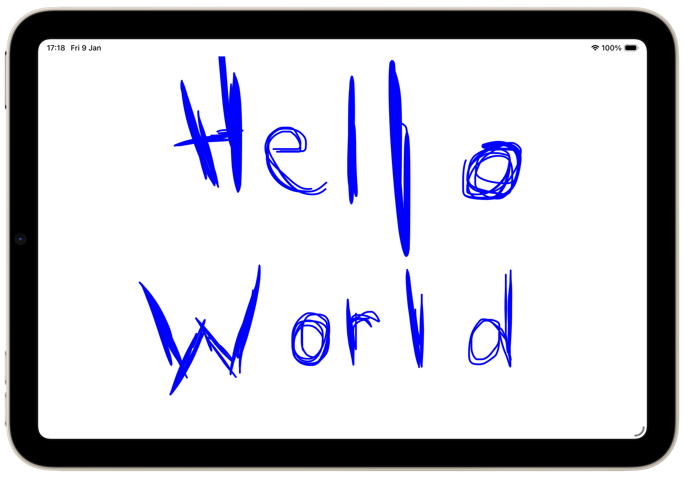
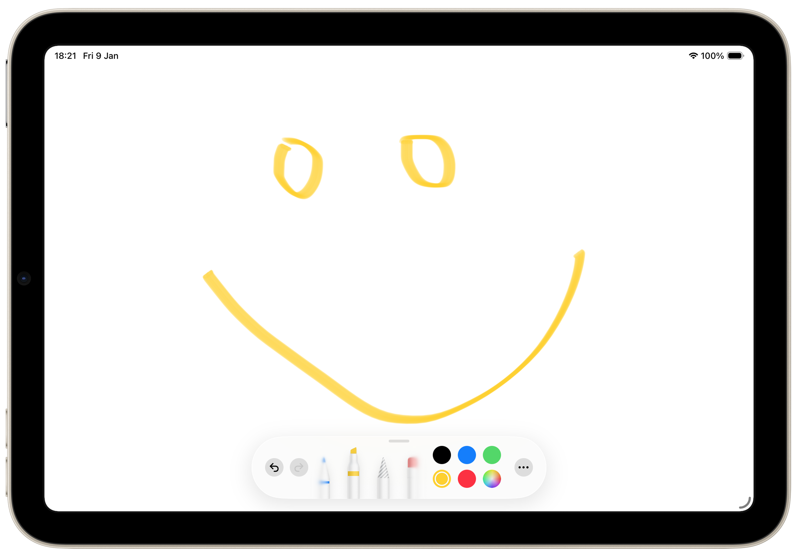
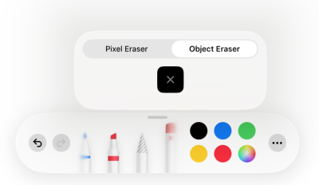
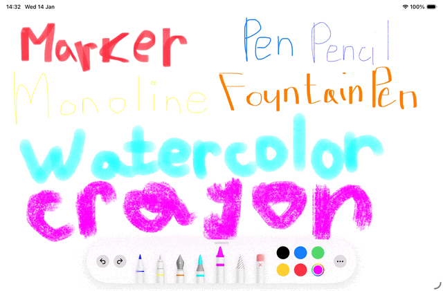

# Introduction to the PencilKit

@Metadata {
    @TitleHeading("About PencilKit")
    @Available("", introduced: "2026.01.08")
    @PageImage(purpose: icon, source:"PencilKit-icon.png")
    @PageImage(purpose: card, source:"PencilKit-card.jpg")
}

This article is a step into the series of articles about building a drawing app with [PencilKit](https://developer.apple.com/documentation/pencilkit). In it, I will try to explain the basics and give some general understanding about the framework.

## Overview

Being a father of a 3-y.o. daughter, I am trying to minimise screen time for her. But it doesn't make sense to completely get rid of gadgets from her life. We live in the world where phones, tablets, etc., are a big part of our daily routine. So it is better to introduce them, but in the proper _safe_ way. Since she loves drawing a lot, I thought it makes sense to use that direction for her relationship with gadgets. And as an iOS developer, my first thought was to build a drawing app. I haven't used [PencilKit](https://developer.apple.com/documentation/pencilkit) before, so while learning it, I want to share my experience. 

Let's look into the basics of drawing with [PencilKit](https://developer.apple.com/documentation/pencilkit)!

## Introduction



[PencilKit](https://developer.apple.com/documentation/pencilkit) is a framework that provides an ability to interact with hand drawn content and provides a set of tools for doing that. It accepts input from Apple Pencil or the user’s finger. This framework provides support for iOS, iPadOS, macOS (plus Mac Catalyst apps) and visionOS.

## What comes in the framework?

### Canvas

[PencilKit](https://developer.apple.com/documentation/pencilkit) provides a [PKCanvasView](https://developer.apple.com/documentation/pencilkit/pkcanvasview) that handles user input, displays it in the UI with low latency. In order to start using a canvas view you need a few lines of code:

```swift
struct CanvasView: UIViewRepresentable {
    func makeUIView(context: Context) -> PKCanvasView {
        let canvas = PKCanvasView()
        canvas.tool = PKInkingTool(.pen, color: .blue, width: 15)
        canvas.drawingPolicy = .anyInput
        return canvas
    }

    func updateUIView(_ uiView: PKCanvasView, context: Context) {}
}
```

> Note: This framework is quite old and hasn't been updated much since iOS 18. As a result, there is no SwiftUI support. It comes from UIKit, and if you want to use it in SwiftUI, you will have to wrap it in [UIViewRepresentable](https://developer.apple.com/documentation/swiftui/uiviewrepresentable) and bridge it into SwiftUI.

Canvas produces a [PKDrawing](https://developer.apple.com/documentation/pencilkit/pkdrawing-swift.struct) object that can be saved, and shared. The Drawing object is a proprietary format that is supported by the [PencilKit](https://developer.apple.com/documentation/pencilkit) framework. You can use it only within the framework. In addition, the content of the drawing can be exported as an image and can be shared as a raster elsewhere.

### Tools



In order to interact with a canvas, the framework provides a set of tools you can use. There are only three tools available: [PKEraserTool](https://developer.apple.com/documentation/pencilkit/pkerasertool-swift.struct), [PKInkingTool](https://developer.apple.com/documentation/pencilkit/pkinkingtool-swift.struct), [PKLassoTool](https://developer.apple.com/documentation/pencilkit/pklassotool-swift.struct). These tools conform to the [PKTool](https://developer.apple.com/documentation/pencilkit/pktool-swift.protocol) protocol. However, it is not possible to make your own tool by adopting to it. Instead, you should create instances of existing tools provided by the framework and only change their configuration.

Alongside the tools, [PencilKit](https://developer.apple.com/documentation/pencilkit) also provides a way to select and configure them. For that purpose, there is a [PKToolPicker](https://developer.apple.com/documentation/pencilkit/pktoolpicker) that allows the user to pick the tool and change its appearance. 

Here is an example of setting up a tool picker with a preconfigured set of tools:

```swift
struct CanvasView: UIViewRepresentable {
    func makeUIView(context: Context) -> PKCanvasView {
        let canvas = PKCanvasView()
        canvas.drawingPolicy = .anyInput
        context.coordinator.picker.setVisible(true, forFirstResponder: canvas)
        context.coordinator.picker.addObserver(canvas)
        canvas.becomeFirstResponder()
        return canvas
    }

    func updateUIView(_ uiView: PKCanvasView, context: Context) {}

    func makeCoordinator() -> Coordinator {
        Coordinator()
    }

    class Coordinator {
        let picker = PKToolPicker(
            toolItems: [
                PKToolPickerInkingItem(type: .pen, color: .red),
                PKToolPickerInkingItem(type: .marker, color: .red),
                PKToolPickerLassoItem(),
                PKToolPickerEraserItem(type: .bitmap, width: 20)
            ]
        )

        init() {}
    }
}
```

Let's have a deeper look at each tool individually.

#### Eraser tool

[PKEraserTool](https://developer.apple.com/documentation/pencilkit/pkerasertool-swift.struct) allows us to delete the object. Deletion can be configured to delete an entire object using [PKEraserTool.EraserType.vector](https://developer.apple.com/documentation/pencilkit/pkerasertool-swift.struct/erasertype-swift.enum/vector) type or [PKEraserTool.EraserType.bitmap](https://developer.apple.com/documentation/pencilkit/pkerasertool-swift.struct/erasertype-swift.enum/bitmap) to remove only those portions of the drawing it touches. Alongside the type, you can also specify a width of the portion you want to remove.

@Row(numberOfColumns: 2) {
    @Column {
        
    }
    @Column {
        
    }
}

#### Inking tool


[PKInkingTool](https://developer.apple.com/documentation/pencilkit/pkinkingtool-swift.struct) allows you to draw lines with a specified pen style, color, and width. Using user's touch input, the inking tool draws a [PKStroke](https://developer.apple.com/documentation/pencilkit/pkstroke-swift.struct). There are a bunch of ink types available in [PencilKit](https://developer.apple.com/documentation/pencilkit) that allow users to draw different content with various configurations. Here is a list of all available ink types:
- [marker](https://developer.apple.com/documentation/pencilkit/pkinkingtool-swift.struct/inktype-swift.enum/marker) - creates the appearance of a felt-tip marker;
- [pen](https://developer.apple.com/documentation/pencilkit/pkinkingtool-swift.struct/inktype-swift.enum/pen) - creates the appearance of a pen-based drawing;
- [pencil](https://developer.apple.com/documentation/pencilkit/pkinkingtool-swift.struct/inktype-swift.enum/pencil) - creates the appearance of a narrow line from a pencil;
- [monoline](https://developer.apple.com/documentation/pencilkit/pkinkingtool-swift.struct/inktype-swift.enum/monoline) - creates the appearance of a monoline pen;
- [fountainPen](https://developer.apple.com/documentation/pencilkit/pkinkingtool-swift.struct/inktype-swift.enum/fountainPen) - creates the appearance of a calligraphy pen;
- [watercolor](https://developer.apple.com/documentation/pencilkit/pkinkingtool-swift.struct/inktype-swift.enum/watercolor) - creates the appearance of a watercolor brush;
- [crayon](https://developer.apple.com/documentation/pencilkit/pkinkingtool-swift.struct/inktype-swift.enum/crayon) - creates the appearance of a crayon.

Here is a code snippet that allows you to create a tool picker with a set of inking tools for each available ink type:

```swift
let picker = PKToolPicker(
    toolItems: [
        PKToolPickerInkingItem(type: .marker, color: .red),
        PKToolPickerInkingItem(type: .pen, color: .green),
        PKToolPickerInkingItem(type: .pencil, color: .blue),
        PKToolPickerInkingItem(type: .monoline, color: .yellow),
        PKToolPickerInkingItem(type: .fountainPen, color: .orange),
        PKToolPickerInkingItem(type: .watercolor, color: .cyan),
        PKToolPickerInkingItem(type: .crayon, color: .magenta)
    ]
)
```

#### Lasso tool

The last available tool is the [PKLassoTool](https://developer.apple.com/documentation/pencilkit/pklassotool-swift.struct). It provides the ability to select stroked lines and shapes on the canvas, which can be moved, copied, cut, or even removed later. The Lasso tool doesn't have any configurations like size or color.

You can add the lasso tool to the tool picker by just providing a [PKToolPickerLassoItem](https://developer.apple.com/documentation/pencilkit/pktoolpickerlassoitem) instance.



### Drawing


Whenever a user interacts with [PKCanvasView](https://developer.apple.com/documentation/pencilkit/pkcanvasview), the [drawing](https://developer.apple.com/documentation/pencilkit/pkcanvasview/drawing) object is being updated. [PKDrawing](https://developer.apple.com/documentation/pencilkit/pkdrawing-swift.struct) is an object that represents a content drawn on the canvas. Treat it as SVG but with simpler and platform-related details. [PencilKit](https://developer.apple.com/documentation/pencilkit) allows you to generate a data representation of it, so you can freely save it in a database or filesystem, and share it. From this data representation, you could create a [PKDrawing](https://developer.apple.com/documentation/pencilkit/pkdrawing-swift.struct) and display/modify it with a PKCanvasView. 

Whenever you share your drawings between different iOS versions, you might need to support a content version of it in order to be able to display or draw on it. There is a specific type, [PKContentVersion](https://developer.apple.com/documentation/pencilkit/pkcontentversion), that is used in [requiredContentVersion](https://developer.apple.com/documentation/pencilkit/pkdrawing-swift.struct/requiredcontentversion) on the drawing, [maximumSupportedContentVersion](https://developer.apple.com/documentation/pencilkit/pkcanvasview/maximumsupportedcontentversion) in the [PKCanvasView](https://developer.apple.com/documentation/pencilkit/pkcanvasview), and a similar [maximumSupportedContentVersion](https://developer.apple.com/documentation/pencilkit/pktoolpicker/maximumsupportedcontentversion) on the [PKToolPicker](https://developer.apple.com/documentation/pencilkit/pktoolpicker). Make sure you set the `maximumSupportedContentVersion` for both the canvas view and the tool picker. However, this is only the case if you want to support iOS lower than 17.0. If you are targeting iOS 17 and above, you shouldn't care about content version compatibility checks unless Apple introduces a new version of the content version with a new set of inks.

If you still need to support iOS releases earlier than 17, please refer to the [Supporting backward compatibility for ink types](https://developer.apple.com/documentation/pencilkit/supporting-backward-compatibility-for-ink-types) guide.

In addition to the data format for persistence, [PencilKit](https://developer.apple.com/documentation/pencilkit) also provides an ability to generate an image of the drawing. You can specify a rect (the portion of the drawing that you want to capture) and a scale (the scale factor at which to create the image) when generating an image.

> Note: Specifying scale factors greater than 1.0 creates an image with more detail. For example, you might specify a scale factor of 2.0 or 3.0 when displaying the image on a Retina display.

## How to interact with a drawing

### Drawing data

 [PKDrawing](https://developer.apple.com/documentation/pencilkit/pkdrawing-swift.struct) is just a container for an array of [strokes](https://developer.apple.com/documentation/pencilkit/pkstroke-swift.struct). Each [PKStroke](https://developer.apple.com/documentation/pencilkit/pkstroke-swift.struct) consists of an [ink](PKInk), [path](https://developer.apple.com/documentation/pencilkit/pkstrokepath-swift.struct), [transform](https://developer.apple.com/documentation/CoreFoundation/CGAffineTransform), and optional [mask](https://developer.apple.com/documentation/UIKit/UIBezierPath). [PKStrokePath](https://developer.apple.com/documentation/pencilkit/pkstrokepath-swift.struct) is a B-spline path that describes this stroke. It contains a `creationDate` and holds an array of control points internally. 

Each [PKStrokePoint](https://developer.apple.com/documentation/pencilkit/pkstrokepoint-swift.struct) contains a set of information about when, where, and how it was drawn. It stores the [location](https://developer.apple.com/documentation/pencilkit/pkstrokepoint-swift.struct/location) of the point and its [timeOffset](https://developer.apple.com/documentation/pencilkit/pkstrokepoint-swift.struct/timeoffset) (time offset since the start of the stroke path in seconds). There is also information about the touch, like [altitude](https://developer.apple.com/documentation/pencilkit/pkstrokepoint-swift.struct/altitude), [azimuth](https://developer.apple.com/documentation/pencilkit/pkstrokepoint-swift.struct/azimuth), and [force](https://developer.apple.com/documentation/pencilkit/pkstrokepoint-swift.struct/force). And of course, the drawing data: the [size](https://developer.apple.com/documentation/pencilkit/pkstrokepoint-swift.struct/size) of the point, its [opacity](https://developer.apple.com/documentation/pencilkit/pkstrokepoint-swift.struct/opacity), and [secondaryScale](https://developer.apple.com/documentation/pencilkit/pkstrokepoint-swift.struct/secondaryscale) (TBH, I don't know what this field is about; there isn't much information in the documentation about it). ...we can construct drawings from the code, inspect them, and even modify them if needed. So there is room for different features we can build upon that foundation.

### Modifying drawing

[PencilKit](https://developer.apple.com/documentation/pencilkit) has a small set of APIs to modify drawings. You can apply a specified [transform](https://developer.apple.com/documentation/pencilkit/pkdrawing-swift.struct/transform(using:)) to the contents of the drawing. Or you can make a [transformed](https://developer.apple.com/documentation/pencilkit/pkdrawing-swift.struct/transformed(using:)) copy of it if you need to generate a new drawing without updating the existing one. Additionally, to transformation, there is a method to [append](https://developer.apple.com/documentation/pencilkit/pkdrawing-swift.struct/append(_:)) one drawing to another. Similarly to transformation, you can generate a new drawing by [appending](https://developer.apple.com/documentation/pencilkit/pkdrawing-swift.struct/appending(_:)) one to another without modifying the source.

### Observing drawing updates

As with any other UI components in UIKit, [PKCanvasView](https://developer.apple.com/documentation/pencilkit/pkcanvasview) has a [delegate](https://developer.apple.com/documentation/pencilkit/pkcanvasview/delegate) that responds to changes in the drawn content or with the selected tool.

[PKCanvasViewDelegate](https://developer.apple.com/documentation/pencilkit/pkcanvasviewdelegate) allows you to listen to start- and end-of-event sequences for the currently selected tool and changes to the drawn content.

## Conclusion

In this article, we've taken our first steps into the world of PencilKit. We've covered the fundamental building blocks, from setting up a canvas to understanding the tools and the data structures that hold our drawings. It's been a fun initial dive, and the framework seems powerful enough for creating the drawing app. In the next article in this series, we'll take what we've learned and start building the actual application. 

Stay tuned!

## Resources

- [PencilKit documentation](https://developer.apple.com/documentation/pencilkit)
- [WWDC 2019 - Introducing PencilKit](https://developer.apple.com/videos/play/wwdc2019/221/)
- [Drawing with PencilKit](https://developer.apple.com/documentation/pencilkit/drawing-with-pencilkit)
